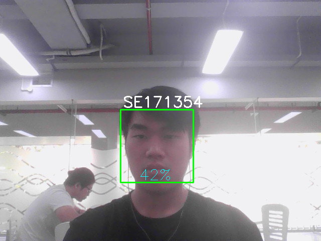
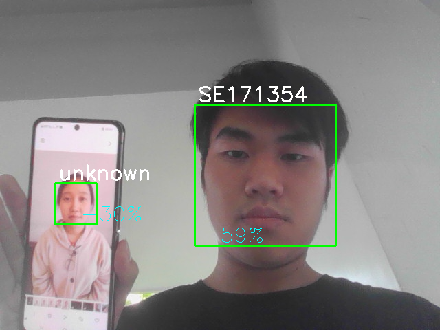

# Face-Reg-opencv
For school

# TODO: Build exe app

# Preview
## TESTING: Run meomeo.py

This program will regconize people when their entire faces when they are facing directly to the camera. Currently only regconize 6 people. If you are not in the database, it will show as "Unknown"

## Example

